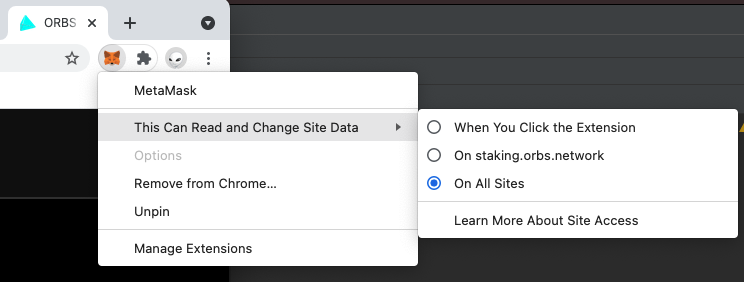

# Troubleshooting Guide

## Select Ethereum Mainnet

Make sure the selected network is Ethereum Mainnet

## Give Metamask network access privileges
On Chrome, right click on Metamask menu to open the browser extension configuration context menu

Check "This Can Read and Change Site Data".

Verify "On All Sites" is selected

## Reload the page and clear cache

More detailed instructions available [here](https://en.wikipedia.org/wiki/Wikipedia:Bypass_your_cache): 

- Most Windows and Linux browsers: Hold down Ctrl and press F5. 
- Apple Safari: Hold down ⇧ Shift and click the Reload toolbar button. 
- Chrome and Firefox for Mac: Hold down both ⌘ Cmd+⇧ Shift and press R.

## Reset Metamask Account

This will *not* require you to enter your password, or your secret recovery phrase again. 

In some scenarios, especially after sending transactions on behalf of a single address from more than one device, resetting your Metamask account is required in order to resume operation. 

Navigate to "Settings"

Click "Advanced"

Scroll down to find your "Reset Account" button

Select and confirm "Reset Account". This will clear your recent transactions list in the "Activity" area in the main Metamask panel. But it will reset and synchronize your local wallet to 

## Restart your browser

If issues persist, close the browser and launch it again
